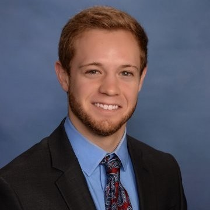

 

## About Me

Senior Software Engineer

[Lockheed Martin Skunk Works](https://www.lockheedmartin.com/en-us/who-we-are/business-areas/aeronautics/skunkworks.html)

PhD Student

[School of Computer Science](https://scs.gatech.edu/)

Advised by [Umakishore Ramachandran](https://www.cc.gatech.edu/~rama/)

[Georgia Institute of Technology](https://www.cc.gatech.edu/)

### Research Interests

My research interests lie in in Edge Computing, specifically in data and control plane optimization to enhance the performance of Edge Computing applications in a geo-distributed setting.

#### Edge Computing

There are many applications now that would be feasible only if we were able to a make a system for the edge that could handle the low latency requirements of these use cases, while also being able to maintain good throughput and performance. My research in this area strives to elevate the Edge to be a peer of the Cloud. 

#### Network Centric Systems

Due to the impressive improvement in network capacity in comparison to compute capacity in recent years, I look to research in the area of modern network centric computing, and how this changes systems architecture and software. 

#### Embedded Systems

Attempting to put the above research areas together is difficult. I have an interest in applying these network centric computing and edge computing concepts to relatively new spaces such as aeronautics and vehicle control systems.

### CV

#### [CV](./cv.md)

### Accomplishments

#### Publications

Coming soon...

#### Fellowships

- Marshall D. Williamson Fellowship
- President's Fellow

